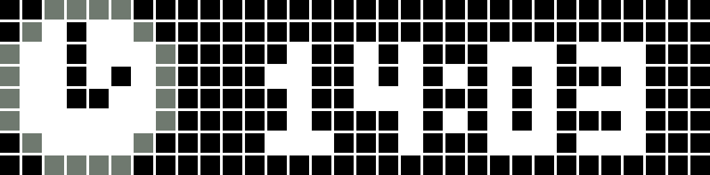

# Native Apps
## Time
The native Time app offers extensive customization options. Almost everything can be configured via the API, and most settings can also be adjusted through the AWTRIX3 app.   
The time format can be customized to your preferences. By default, it is set to `HH:mm`.   
If the selected format doesn't fit on the screen, it will automatically revert to this default.   
You might notice some lines at the bottom of the screen. These lines represent the weekdays, with the current day highlighted brighter. It is also possible to deactive this weekday bar.  
You can also customize the colors for the calendar icon, the weekday bar and also the textcolor with the [SettingsAPI](https://blueforcer.github.io/awtrix3/#/api?id=change-settings) or the mobile App.    

The `TMODE` setting determines the layout and style of the Time App. 

 **TMODE=0**  
  
Displays the time along with a weekday bar at the bottom of the screen.  
  
**TMODE=1**  
   
Shows the time with the weekday bar on the bottom and a calendar box that highlights the current day of the month.  

**TMODE=2**  
   
Similar to `TMODE=1`, but places the weekday bar at the top.   

**TMODE=3**  
   
Displays the time with the weekday bar at the bottom and a different calendar icon.  

**TMODE=4**  
   
Similar to `TMODE=3`, but places the weekday bar at the top.    

**TMODE=5**  
   
Introduces a "big time" display, utilizing a large font for the time.  
If a 32x8 GIF named `bigtime.gif` exists in the root directory, it will be played in the background.  
Please note: Once the GIF is displayed in BigTime mode, it cannot be directly replaced because the file is in use.  
To replace the icon, switch the mode to TMODE first, and then you'll be able to update the GIF.    
If no GIF is found, the global textcolor is used.     

[You can get some bigtime GIFs examples here](https://github.com/Blueforcer/awtrix3/tree/main/Bigtime_GIFs).   

**TMODE=6**  
   
Displays the time in **binary format**:  
The top row shows the hour, the middle row shows the minutes, and the bottom row shows the seconds.  
Each row has six dots, where lit dots represent binary "1" and white dots represent binary "0".  
To read the time, convert the lit dots in each row to a decimal number.     

**TMODE=7**  
   
Adds an icon to the left side of the time display.  
If a GIF named `time.gif` exists in the root directory, it will be used instead of the default clock icon.  
Both 8X8 and 32X8 GIFs are supported.   
If the weekday bar is enabled, it will be displayed at the bottom of the screen.   

**TMODE=8**  
   
Same as `TMODE=7`, but moves the weekday bar to the top of the screen.

#### **Available Time Formats:**  
| Format       | Example    | Description                                |
|--------------|------------|--------------------------------------------|
| `%H:%M:%S`   | `13:30:45` | 24-hour time with seconds                 |
| `%l:%M:%S`   | `1:30:45`  | 12-hour time with seconds                 |
| `%H:%M`      | `13:30`    | 24-hour time                              |
| `%H %M`      | `13.30`    | 24-hour time with blinking colon          |
| `%l:%M`      | `1:30`     | 12-hour time                              |
| `%l %M`      | `1:30`     | 12-hour time with blinking colon          |
| `%l:%M %p`   | `1:30 PM`  | 12-hour time with AM/PM indicator         |
| `%l %M %p`   | `1:30 PM`  | 12-hour time with blinking colon and AM/PM|

---
## Date
  

The Dateapp shows the current date of course. There are several dateformats 'DFORMAT' you can choose from:  

#### **Available Date Formats:**  
| Format       | Example    | Description            |
|--------------|------------|------------------------|
| `%d.%m.%y`   | `16.04.22` | Day.Month.Year (short) |
| `%d.%m`      | `16.04`    | Day.Month             |
| `%y-%m-%d`   | `22-04-16` | Year-Month-Day         |
| `%m-%d`      | `04-16`    | Month-Day             |
| `%m/%d/%y`   | `04/16/22` | Month/Day/Year         |
| `%m/%d`      | `04/16`    | Month/Day             |
| `%d/%m/%y`   | `16/04/22` | Day/Month/Year         |
| `%d/%m`      | `16/04`    | Day/Month             |
| `%m-%d-%y`   | `04-16-22` | Month-Day-Year         |

---
## Temperature  

  

The Temperature App displays the current reading from the integrated temperature sensor.  
However, due to the sensor's placement inside the housing, the measurement may not be entirely accurate.   
Factors such as the power board, LED matrix, brightness, color, and the number of lit pixels can affect the temperature reading.  
For more precise messurement, you can utilize the [dev.json](https://blueforcer.github.io/awtrix3/#/dev) to calibrate the temperature with the `temp_offset` key. 

---
## Humidity  

  

The humidity App displays the current reading from the integrated humidity sensor.  
However, due to the sensor's placement inside the housing, the measurement may not be entirely accurate.   
Factors such as the power board, LED matrix, brightness, color, and the number of lit pixels can affect the humidity reading.  
For more precise messurement, you can utilize the [dev.json](https://blueforcer.github.io/awtrix3/#/dev) to calibrate the temperature with the `hum_offset` key. 

---
## Battery  

  

The Battery App displays the current charge level of the integrated battery.  
Due to differences in battery batches and the degradation of the cheap battery over time, you may need to calibrate it manually.

1. Use the [Status API](https://blueforcer.github.io/awtrix3/#/api?id=status-retrieval) to retrieve the `bat_raw` readings.  
2. Open the [dev.json](https://blueforcer.github.io/awtrix3/#/dev) file to configure the `min_battery` and `max_battery` values:  
   - **`min_battery`**: Enter the `bat_raw` value when the battery is empty.  
   - **`max_battery`**: Enter the `bat_raw` value when the battery is fully charged.  

---
# Custom Apps

Besides the native apps, AWTRIX3 is designed to integrate seamlessly with your smart home ecosystem, additional applications can be created using MQTT or HTTP requests.

!> In AWTRIX, the term 'Custom Apps' does not refer to traditional smartphone apps that you download and install. Instead, in AWTRIX, CustomApps function more like dynamic pages that rotate within the Apploop rotation of the display. These pages do not store or execute their own logic; instead, they display content that is sent from an external system, such as a smarthome. This content must be transmitted using MQTT or HTTP protocols via the [CustomApp API](https://blueforcer.github.io/awtrix3/#/api?id=custom-apps-and-notifications).  
It is important to note that all the logic for managing the content displayed in these CustomApps needs to be handled by your external system. AWTRIX only provides the platform for displaying the information. You have the flexibility to update the content shown on your CustomApps in real-time at any moment, making it a versatile tool for displaying personalized information in your smarthome setup.

There are numerous benefits to this approach:

- **Personalization:** Customize each application to suit your preferences and needs.
- **Flexibility:** Develop your own applications without the need to modify the firmware.
- **Efficient resource management:** Save valuable flash memory space on the ESP module.
- **Adaptability:** No need to rewrite the firmware if an API undergoes changes.

You can use any system you like which is able to build json strings and send them to a mqtt topic.

## AWTRIX FLOWS
This is your go-to hub for sharing and discovering AWTRIX 3 automations, also known as custom Apps for several services.  
Enhance your AWTRIX 3 experience, exchange ideas, and get inspired. Lets bring our creative automations to life together!  
No login is necessary, neither for creating new flows. As a creator you will get a link with which you can always edit your flow. Keep it save!  
You can upload your icons to your flow, and user can copy them directly to their AWTRIX 3 with one click!  
New flows are regularly moderated.  
https://flows.blueforcer.de/   
    

## Flow example with Node-RED
[Node-RED](https://nodered.org/) serves as an ideal software solution for creating these applications.  
It is available as a standalone program or as a plugin for Home Assistant and ioBroker, allowing you to further enhance the capabilities of your AWTRIX 3 system.
    
Here is a demo, please press the triangle to unfold.

  
Example for adding a Youtube App as NodeRED flow
    
  <pre><code class="language-json">
[
  {
    "id": "2a59d30d07abe14f",
    "type": "group",
    "z": "54b42d8d.cda474",
    "style": {
      "stroke": "#999999",
      "stroke-opacity": "1",
      "fill": "none",
      "fill-opacity": "1",
      "label": true,
      "label-position": "nw",
      "color": "#a4a4a4"
    },
    "nodes": [
      "f0f17299.3736c",
      "dc7878f9.4756c8",
      "f234aae371d72680",
      "555bb8624b88c9c3",
      "69c388146e28049d",
      "a349ade5a57f7537"
    ],
    "x": 34,
    "y": 39,
    "w": 892,
    "h": 122
  },
  {
    "id": "f0f17299.3736c",
    "type": "inject",
    "z": "54b42d8d.cda474",
    "g": "2a59d30d07abe14f",
    "name": "",
    "props": [],
    "repeat": "3600",
    "crontab": "",
    "once": true,
    "onceDelay": 0.1,
    "topic": "",
    "x": 130,
    "y": 120,
    "wires": [
      [
        "a349ade5a57f7537"
      ]
    ]
  },
  {
    "id": "dc7878f9.4756c8",
    "type": "http request",
    "z": "54b42d8d.cda474",
    "g": "2a59d30d07abe14f",
    "name": "",
    "method": "GET",
    "ret": "obj",
    "paytoqs": "query",
    "url": "https://youtube.googleapis.com/youtube/v3/channels",
    "tls": "",
    "persist": false,
    "proxy": "",
    "insecureHTTPParser": false,
    "authType": "",
    "senderr": false,
    "headers": [],
    "x": 430,
    "y": 120,
    "wires": [
      [
        "f234aae371d72680"
      ]
    ]
  },
  {
    "id": "f234aae371d72680",
    "type": "function",
    "z": "54b42d8d.cda474",
    "g": "2a59d30d07abe14f",
    "name": "parser",
    "func": "var json = msg.payload;\nvar subscriberCount = json.items[0].statistics.subscriberCount;\n\nmsg.payload = { \"text\": subscriberCount, \"icon\": 5029};\nreturn msg;",
    "outputs": 1,
    "noerr": 0,
    "initialize": "",
    "finalize": "",
    "libs": [],
    "x": 590,
    "y": 120,
    "wires": [
      [
        "555bb8624b88c9c3"
      ]
    ]
  },
  {
    "id": "555bb8624b88c9c3",
    "type": "mqtt out",
    "z": "54b42d8d.cda474",
    "g": "2a59d30d07abe14f",
    "name": "",
    "topic": "ulanzi/custom/youtube",
    "qos": "",
    "retain": "",
    "respTopic": "",
    "contentType": "",
    "userProps": "",
    "correl": "",
    "expiry": "",
    "broker": "346df2a95aac5785",
    "x": 800,
    "y": 120,
    "wires": []
  },
  {
    "id": "69c388146e28049d",
    "type": "comment",
    "z": "54b42d8d.cda474",
    "g": "2a59d30d07abe14f",
    "name": "Youtube Follower",
    "info": "Just enter your channelID and Youtube API key in the \"Data\" node  and set your AWTRIX MQTT prefix.\nUses Icon 5029 (LM)",
    "x": 140,
    "y": 80,
    "wires": []
  },
  {
    "id": "a349ade5a57f7537",
    "type": "function",
    "z": "54b42d8d.cda474",
    "g": "2a59d30d07abe14f",
    "name": "Data",
    "func": "msg.payload = { \"id\": \"UCpGLALzRO0uaasWTsm9M99w\", \"key\": \"XXX\", \"part\":\"statistics\"}\nreturn msg;",
    "outputs": 1,
    "noerr": 0,
    "initialize": "",
    "finalize": "",
    "libs": [],
    "x": 270,
    "y": 120,
    "wires": [
      [
        "dc7878f9.4756c8"
      ]
    ]
  },
  {
    "id": "346df2a95aac5785",
    "type": "mqtt-broker",
    "name": "",
    "broker": "localhost",
    "port": "1883",
    "clientid": "",
    "autoConnect": true,
    "usetls": false,
    "protocolVersion": "4",
    "keepalive": "60",
    "cleansession": true,
    "birthTopic": "",
    "birthQos": "0",
    "birthPayload": "",
    "birthMsg": {},
    "closeTopic": "",
    "closeQos": "0",
    "closePayload": "",
    "closeMsg": {},
    "willTopic": "",
    "willQos": "0",
    "willPayload": "",
    "willMsg": {},
    "userProps": "",
    "sessionExpiry": ""
  }
]  
  </code></pre>

This Node-RED flow retrieves and displays the subscriber count of a specified YouTube channel on an AWTRIX 3 device. The flow consists of the following nodes:

1. **Inject**: This node triggers the flow periodically (every hour) or manually.
2. **Data (Function)**: This node contains the YouTube channel ID and the YouTube API key. Replace "XXX" with your YouTube API key and Youtube ID. The node constructs a payload containing the channel ID, API key, and required statistics and sends it to the "HTTP request" node.
3. **HTTP request**: This node sends a GET request to the YouTube API to retrieve the channel's statistics. The response is returned as a JavaScript object and passed to the "parser" node.
4. **parser (Function)**: This node extracts the subscriber count from the received channel statistics and constructs a payload containing the count and an icon (Icon 5029). The payload is sent to the "MQTT out" node.
5. **MQTT out**: This node publishes the payload to the MQTT topic "ulanzi/custom/youtube" on a local MQTT broker. You also have to change the topic in this node to fit your mqtt prefix.
6. **Comment (Youtube Follower)**: This node contains additional information about the flow. It does not affect the flow's functionality.

To use this flow, replace the "XXX" in the "Data" node with your YouTube API key and ensure that the MQTT broker settings in the "MQTT out" node are correct.
The flow will then retrieve the subscriber count of the specified YouTube channel and display it on your AWTRIX device along with the icon.
This Flow uses icon 5029 from LM (Just download it from the awtrix webinterface). You can change the icon in the flow to your favorite one.

