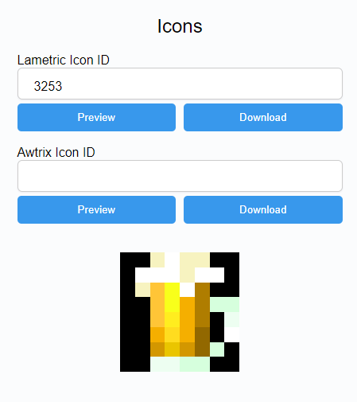

# Icons

AWTRIX Light doesn't offer any cloud connection like AWTRIX 2.0. However, to use your favorite icon for a custom page or notification, you can use the integrated icon downloader in the web interface.

To download an icon, simply enter the ID of a LaMetric or AWTRIX 2.0 icon in the input field. After previewing the icon, you can download it and use it instantly without the need to restart or convert anything. You can find LaMetric icons at [lametric.com](https://developer.lametric.com/icons).

AWTRIX 2.0 icons can be found in the respective software. In a future update, non-AWTRIX 2.0 users will also get access to the database.

You can also create your own icon and place it in the "ICONS" folder via the web interface file browser.  
The icon needs to be a GIF (.gif) or JPG (.jpg) with a resolution of 8x8.
  
!> The Awtrix GIF renderer only supports 8bit gifs at the moment without transparency.
If you have some graphic glitches on the matrix, try to replace the transparency pixels with solid blak color.
For example with this [online tool](https://onlinegiftools.com/add-gif-background)
